<div align="center">

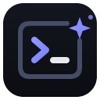

# Pulse

**A persistent terminal manager for Windows. Your sessions survive reboots.**

[](https://github.com/aipulsedaily/pulse/actions/workflows/ci.yml)
[](#license)
[](#install)
[](https://www.rust-lang.org)

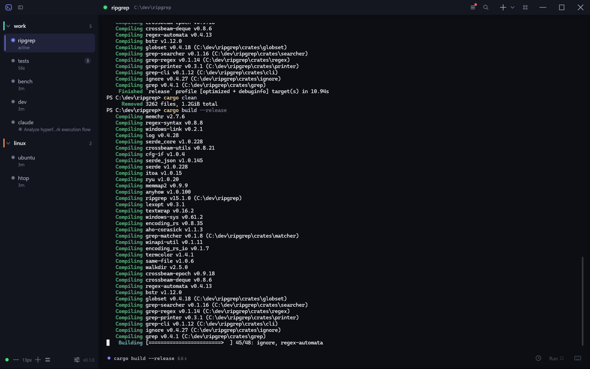

</div>

---

Pulse keeps your terminals alive. A background daemon owns every
[ConPTY](https://learn.microsoft.com/en-us/windows/console/pseudoconsoles)
session and journals its scrollback to disk, so closing the window — or
rebooting the machine — never loses your work. Reopen the app and every
terminal is exactly where you left it: same directory, same scrollback, same
running program, right down to your Claude Code sessions.

It is a single native Rust binary (egui + wgpu, DirectX 12) with a seamless,
zero-divider UI: no tabs, no chrome to fight, just your terminals in folders on
the left and a full-height view on the right.

## Features

### Persistent sessions that survive reboots

Every terminal's scrollback, working directory, and program are journaled by a
background daemon. Close the app, log out, or reboot — when you come back, the
daemon has already relaunched your terminals and replayed their history above a
restore marker. Nothing to re-open, nothing to re-`cd`.

### Folders and a seamless sidebar

Organize terminals into color-tagged folders. Drag to reorder, rename inline,
collapse groups. The sidebar is pure hover-reveal chrome — no dividers, no
visual noise — with a live activity dot per terminal.

<div align="center">
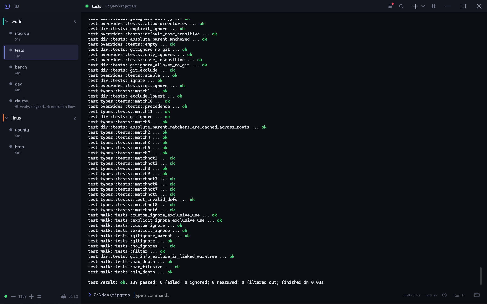
</div>

### A dashboard of live previews

One click zooms out to a card grid of every terminal — live scrolling
previews, folder-scoped or all — so you can watch a build, a benchmark, and a
server at the same time. Click a card to jump in.

<div align="center">
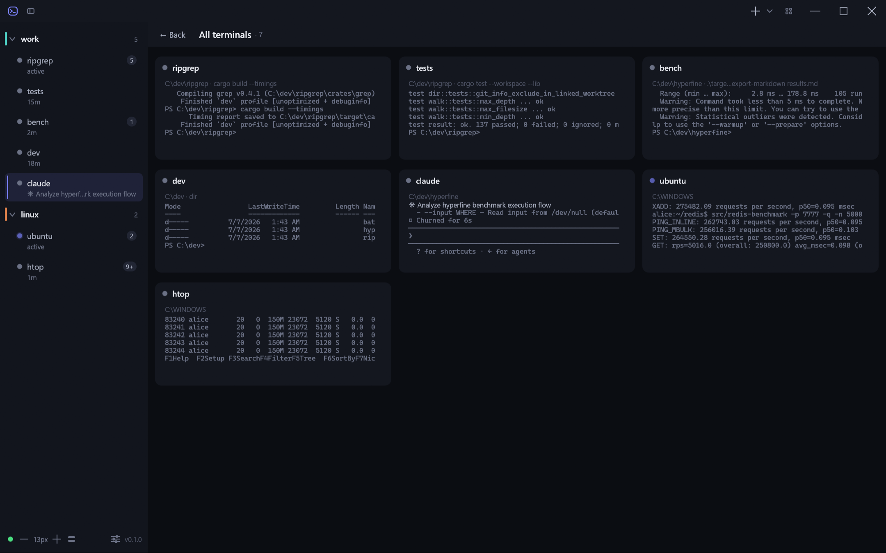
</div>

### An always-there command composer

A persistent composer sits under every terminal. Type a command, hit **Run**,
and it executes at the prompt — with history, multi-line editing (Shift+Enter),
and a live busy indicator. It covers the prompt row seamlessly, so the terminal
reads as one continuous surface.

<div align="center">
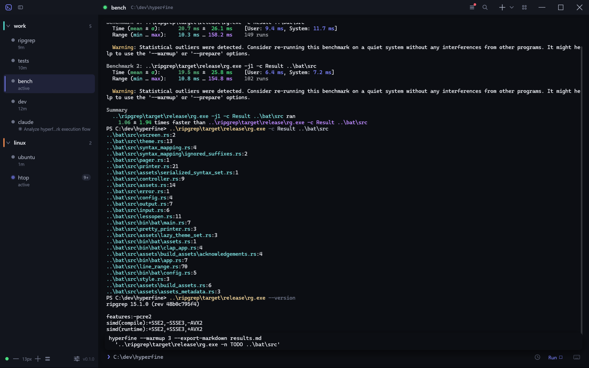
</div>

Every command you run — in any terminal, past or present — lands in a
cross-session history you can search and re-run from the composer.

<div align="center">
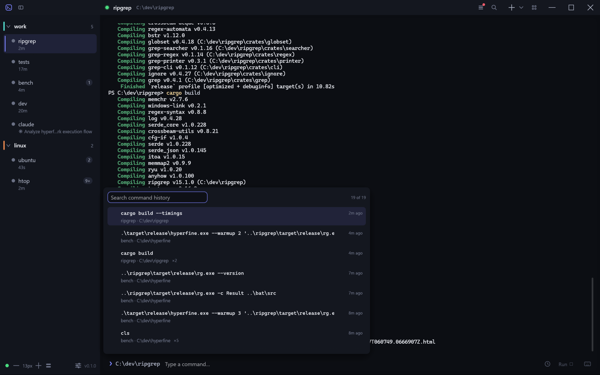
</div>

### Search the whole scrollback

Full-scrollback search with live match highlighting and a match counter —
including everything replayed from the journal after a restart.

<div align="center">
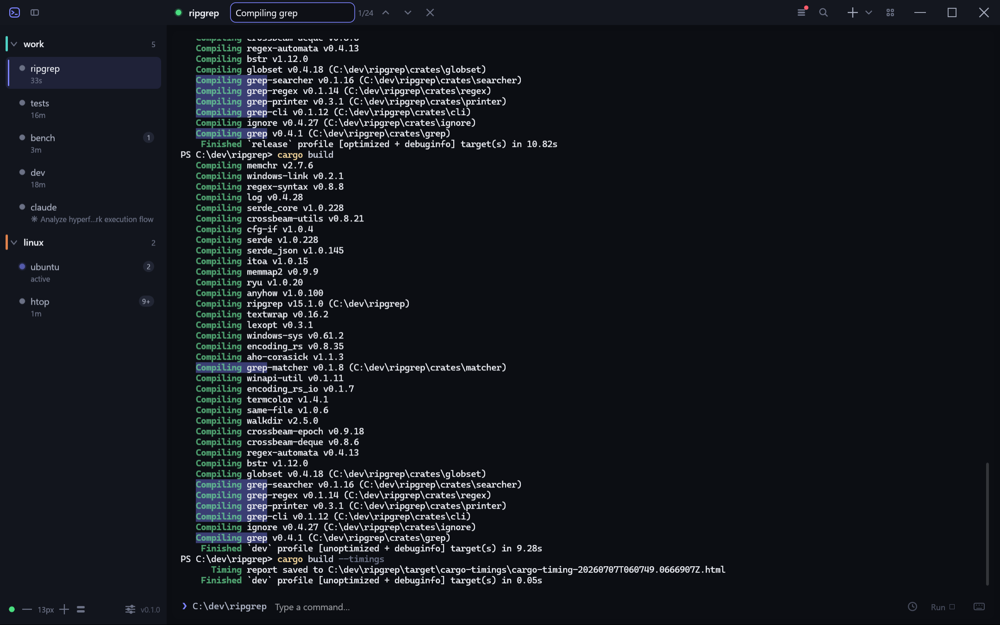
</div>

### Claude Code and Codex session attribution

Pulse recognizes when you launch [Claude
Code](https://www.claude.com/product/claude-code) or Codex inside a terminal,
pins the session identity, and restores it deterministically with `--resume`
after a restart — never guessing "most recent". The sidebar row shows what the
session is working on, live.

<div align="center">
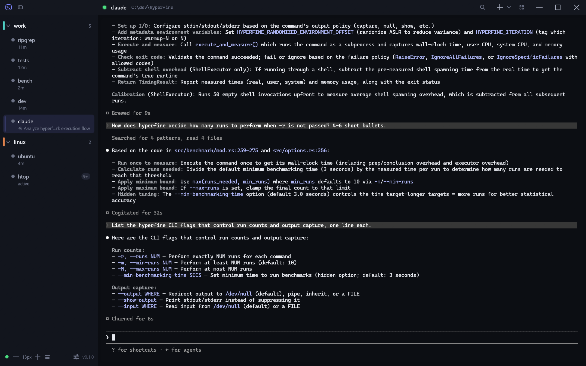
</div>

### SSH and WSL terminals

First-class WSL (per-distro) and SSH terminals alongside PowerShell and cmd.
SSH terminals auto-reconnect after an unexpected drop, and file drag-and-drop
uploads over SFTP. WSL and SSH sessions keep POSIX paths and restore into the
right remote directory. Everything spawns from one palette: shells, WSL
distros, SSH hosts, recent directories, and fresh or reattached Claude
sessions.

<div align="center">
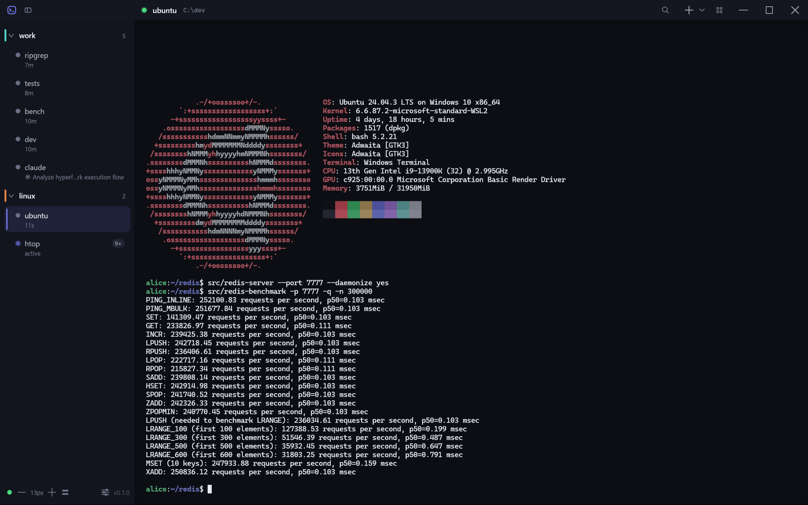
</div>

<div align="center">
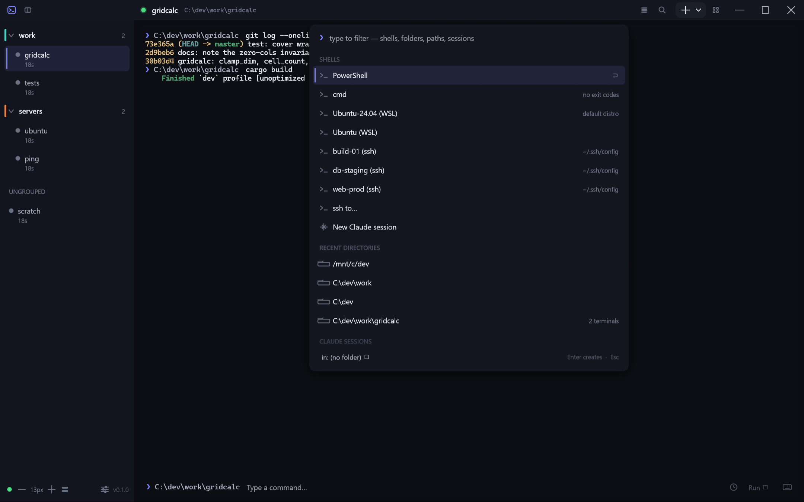
</div>

### Settings that stay out of the way

Font size, sidebar density, scrollback depth, copy-on-select, paste guards, and
per-host permission consents — all in a quiet, modal-light settings surface
that matches the app's zero-divider doctrine.

<div align="center">
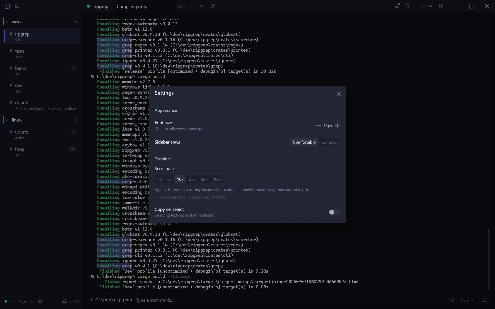
</div>

### Seamless background updates

Pulse updates itself in place with [Velopack](https://velopack.io) —
delta downloads, a branded updating window, and your terminals restored the
moment the new version boots. A pre-update backup of your layout is kept
automatically.

<div align="center">
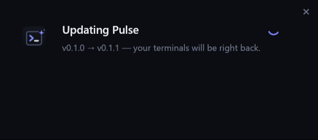
</div>

### Drive it from scripts and agents

A companion `pulse-ctl.exe` controller speaks JSON: list terminals, run commands and
wait for them, read the screen or scrollback, watch live events, and manage
sessions — with scoped tokens for agents. See
[`docs/controller-api.md`](docs/controller-api.md).

## Install

### Download the installer

1. Grab the latest **`Setup.exe`** from the
   [Releases](https://github.com/aipulsedaily/pulse/releases) page.
2. Run it. Pulse installs per-user (no admin prompt), adds a Start
   Menu shortcut, and launches. Updates are automatic from then on.

> The installer is currently unsigned, so Windows SmartScreen may warn on first
> run — choose **More info -> Run anyway**. Signing is on the roadmap.

### Building from source

Prerequisites: a recent [Rust toolchain](https://rustup.rs) (stable, MSVC) on
Windows 10/11.

```sh
git clone https://github.com/aipulsedaily/pulse
cd pulse
cargo build --release
```

The GUI is `target/release/pulse.exe`; the controller is
`target/release/pulse-ctl.exe`. Run the GUI once and it starts its own background
daemon.

## Architecture

Pulse is a single binary with three roles:

- **GUI** (default) — the egui/wgpu window. Attaches to the daemon over a
  loopback TCP socket (length-prefixed `bincode`) and renders terminals from a
  live mirror of the daemon's state.
- **`--daemon`** — a headless broker that owns every ConPTY, streams output to
  attached clients, and writes an append-only journal per terminal. It answers
  VT queries, survives the GUI closing, and relaunches terminals on boot.
- **`--probe`** — a built-in self-test suite (`pulse-ctl.exe` is a thin
  console companion built from the same crate).

The **journal + mirror** model is the core idea: the daemon is the single
source of truth on disk, the GUI is a stateless view, and `pulse-ctl.exe` is a
thin JSON client. Because scrollback lives in journals, any client can reattach at
any time and see the full history.

Design docs for each subsystem live in [`docs/`](docs/) — read them for the
*why*; read the code for the current truth.

## Roadmap

- [ ] Code signing for the installer (remove the SmartScreen warning)
- [ ] A published GitHub Releases feed for auto-updates
- [ ] Broader shell hooks and completions
- [ ] **macOS port** (the daemon/journal model is portable; the ConPTY layer
      and Win32 chrome are the Windows-specific pieces)

## Contributing

Contributions are welcome. See [CONTRIBUTING.md](CONTRIBUTING.md) for build
prerequisites, the test/probe suite, and the UI doctrine the project follows.
Bug reports and feature requests go through
[GitHub Issues](https://github.com/aipulsedaily/pulse/issues).

## License

Licensed under either of

- MIT license ([LICENSE-MIT](LICENSE-MIT) or
  <https://opensource.org/licenses/MIT>)
- Apache License, Version 2.0 ([LICENSE-APACHE](LICENSE-APACHE) or
  <https://www.apache.org/licenses/LICENSE-2.0>)

at your option.

The embedded terminal widget is adapted from
[egui_term](https://github.com/Harzu/egui_term) (MIT).

### Contribution

Unless you explicitly state otherwise, any contribution intentionally submitted
for inclusion in the work by you, as defined in the Apache-2.0 license, shall be
dual licensed as above, without any additional terms or conditions.
